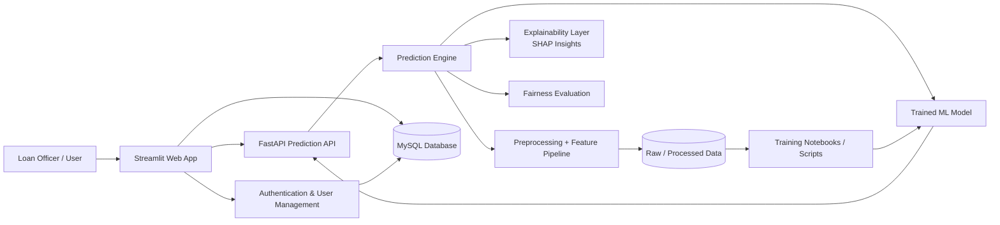

# Explainable AI Loan Default Prediction


An **end-to-end Machine Learning ecosystem** designed to predict loan default risks while prioritizing **Explainable AI (XAI)**, data security, and fairness. This project is built as a robust, enterprise-grade prototype to demonstrate how AI can be integrated into financial services responsibly and transparently.

---

## 📖 Overview

In the financial sector, a "black-box" model is often unacceptable due to regulatory requirements and the need for human oversight. This project bridges the gap between complex ML predictions and human interpretability. 

It provides an end-to-end solution featuring:
1. A **data processing pipeline** that handles class imbalance and feature engineering.
2. A **predictive model (XGBoost)** that estimates the probability of default.
3. An **Explainability layer (SHAP)** that explains exactly *why* a decision was made.
4. A secure **FastAPI backend** that serves the model and handles mock third-party integrations (e.g., Credit Bureaus).
5. An interactive **Streamlit Dashboard** for loan officers to evaluate applications in real-time.

---

## ✨ Key Features & Business Value

- **Explainable AI (SHAP):** Provides a transparent breakdown of feature contributions for every single prediction, empowering loan officers to make informed decisions rather than blindly trusting an algorithm.
- **Microservices Architecture:** Decouples the ML model serving (FastAPI) from the user interface (Streamlit) for better scalability and separation of concerns.
- **Enterprise-Grade Security:** Simulates PII data encryption (using `cryptography` Fernet) to demonstrate how sensitive applicant data should be handled in production.
- **Fairness & Bias Evaluation:** Incorporates fairness checks to ensure the model does not discriminate based on protected attributes, aligning with regulatory compliance standards.
- **Resilient Integrations:** Mocks enterprise external API calls (e.g., pulling Credit Scores) with robust retry logic and error handling.
- **Automated Testing:** Uses `pytest` to ensure pipeline and endpoint reliability.

---

## 🛠️ Technology Stack

| Category | Technologies |
| :--- | :--- |
| **Machine Learning** | Scikit-Learn, XGBoost, SHAP, Pandas, NumPy, imbalanced-learn |
| **Backend & API** | FastAPI, Pydantic, SQLAlchemy, Uvicorn, httpx |
| **Frontend UI** | Streamlit, Plotly |
| **Security & Auth** | bcrypt, Python Cryptography (Fernet) |
| **Testing** | Pytest |

---

## 🏗️ System Architecture
The system follows a modular architecture with a clear separation between the user interface, prediction service, data access layer, and machine learning pipeline.



---

## 📁 Project Structure

```text
AI-loan-default-prediction/
│
├── .streamlit/
│   └── config.toml
│
├── api/
│   └── main.py
│
├── app/
│   └── app.py
│
├── assets/
│   ├── Correlation Matrix of Numeric Features.png
│   ├── Global Feature Importance.png
│   ├── Home Ownership vs Default.png
│   ├── Income vs Loan Amount.png
│   ├── Loan Grade vs Default.png
│   ├── Loan-to-Income Ratio Distribution.png
│   └── Model Performance Comparison.png
│
├── data/
│   ├── processed/
│   │   ├── cleaned_data.csv
│   │   ├── featured_data.csv
│   │   └── model_data.csv
│   └── row/
│       └── credit_risk_dataset.csv
│
├── database/
│   └── schema.sql
│
├── Docker/
│   ├── .dockerignore
│   ├── docker-compose.yml
│   └── Dockerfile
│
├── models/
│   ├── best_model.pkl
│   ├── logistic_regression.pkl
│   ├── random_forest.pkl
│   └── xgboost.pkl
│
├── notebooks/
│   ├── 01_data_understanding.ipynb
│   ├── 02_data_cleaning.ipynb
│   ├── 03_exploratory_data_analysis.ipynb
│   ├── 04_feature_engineering.ipynb
│   ├── 05_model_training.ipynb
│   ├── 06_model_comparison.ipynb
│   └── 07_model_explainability.ipynb
│
├── src/
│   ├── __init__.py
│   ├── config.py
│   ├── credit_bureau_api.py
│   ├── database.py
│   ├── encryption.py
│   ├── fairness.py
│   ├── feature_engineering.py
│   ├── logging_config.py
│   ├── prediction.py
│   └── preprocessing.py
│
├── tests/
│   ├── test_api.py
│   ├── test_config.py
│   ├── test_database.py
│   ├── test_encryption.py
│   ├── test_fairness.py
│   └── test_prediction.py
│
├── .gitignore
├── loan_system.db
├── pytest.ini
├── README.md
├── requirements.txt
├── run.bat
└── run.py


```

---

## ⚙️ Setup & Installation

### Prerequisites
- Python 3.10+
- Git
- MySQL server available locally or via Docker (optional if using SQLite fallback)
- A trained model artifact in the `models/` directory
- Access to create and activate a virtual environment

### 1. Clone the Repository
```bash
git clone https://github.com/HimashMadushanka/Ai-loan-default-prediction.git
cd AI-loan-default-prediction
```

### 2. Create a Virtual Environment
```bash
python -m venv .venv
```

Activate it:

- Windows PowerShell:
```powershell
.\.venv\Scripts\Activate.ps1
```

- macOS/Linux:
```bash
source .venv/bin/activate
```

### 3. Install Dependencies
```bash
pip install -r requirements.txt
```

### 4. Configure Environment Variables
Create a `.env` file in the project root with the following values:
```env
API_KEY=your_secure_api_key_here
ENCRYPTION_KEY=your_fernet_encryption_key_here
DB_HOST=127.0.0.1
DB_PORT=3306
DB_USER=root
DB_PASSWORD=your-password
DB_NAME=loan_system
```

> Never commit real secrets or credentials to version control.

### 5. Prepare the Database
If MySQL is being used, create the database first:
```sql
CREATE DATABASE loan_system;
```

Then load the schema from `database/schema.sql` if required by your environment.

### 6. Train or Place a Model
The API expects a model artifact such as `models/best_model.pkl` before predictions can be processed. If the file is not present, train the model using the notebooks or project scripts first.

---

### ⚡ Quick Start: Run Full Project via Terminal
To run the entire application ecosystem from your terminal, it is best to use two separate terminal tabs or windows. Make sure your virtual environment (`.venv`) is activated in both.

**Terminal 1 (Data Pipeline & Backend API):**
```bash
# 1. (Optional) Run the data pipeline
python src/preprocessing.py
python src/feature_engineering.py

# 2. Start the FastAPI Server
uvicorn api.main:app --reload
```

**Terminal 2 (Frontend Dashboard):**
```bash
# 3. Start the Streamlit Dashboard
streamlit run app/app.py
```

> The dashboard will open in your default browser and connect to the API automatically.

---

### 1. Model Retraining (Optional)
If you wish to retrain the models from scratch using the raw data:
```bash
python src/preprocessing.py
python src/feature_engineering.py
```

> You can then run the notebook under `notebooks/05_model_training.ipynb` to generate the `.pkl` artifacts.

### 2. Launch the FastAPI Backend
Start the REST API that serves the model:
```bash
uvicorn api.main:app --reload
```

- Swagger Docs: `http://localhost:8000/docs`
- ReDoc: `http://localhost:8000/redoc`

### 3. Launch the Streamlit Dashboard
In a new terminal window with the virtual environment activated, start the frontend:
```bash
streamlit run app/app.py
```

The dashboard will open automatically in your browser, allowing you to input applicant data and view the real-time risk assessment and SHAP explanations.

### 4. Single-Command All-in-One Launcher
Run both FastAPI and Streamlit together:
```bash
python run.py
# Or on Windows:
run.bat
```

### 5. Run with Docker (Containerized)
Run the entire stack in an isolated container:
```bash
# Start container in background
docker compose up -d

# Check status
docker compose ps

# View logs
docker compose logs -f

# Stop container
docker compose down
```

---

## 🧪 Testing

To ensure the integrity of the predictive pipeline and endpoints, run the automated test suite:
```bash
pytest tests/ -v
```

---

## ⚠️ Important Considerations & Limitations

This project is built as a portfolio and educational prototype to demonstrate full-stack ML engineering capabilities.

If this were to be deployed in a real-world financial institution, the following would be required:
- Regulatory compliance and fairness validation
- Production infrastructure and model monitoring
- Secure integration with actual credit bureau systems

---

## 👨‍💻 Author
**Himash Madushanka**

Feel free to reach out or open an issue if you have questions or suggestions!
