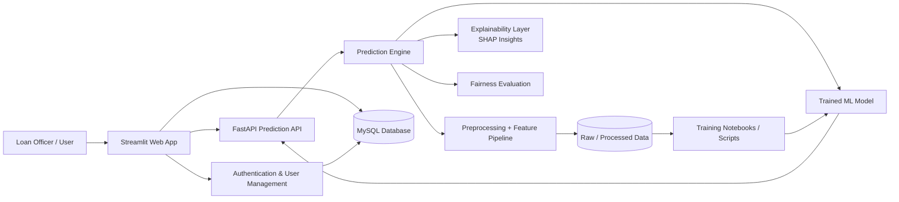

# AI Loan Default Prediction


A full-stack, explainable AI project for evaluating loan default risk using structured credit data. The application combines a machine learning pipeline with a FastAPI backend and an interactive Streamlit dashboard, making it suitable for demos, portfolio projects, and exploratory credit-risk workflows.

> This project is a portfolio prototype and is not intended for real lending decisions or compliance-critical financial use.

## Overview

This solution is designed to demonstrate how predictive analytics can support decision support in credit risk assessment. It includes:

- data cleaning and preprocessing utilities
- feature engineering and model training workflows
- explainability with SHAP
- fairness analysis utilities
- REST API for predictions
- user-friendly dashboard for loan officer workflows
- MySQL-backed storage and secure user authentication

## Key Features

- Predictive modeling for loan default risk using scikit-learn and XGBoost
- Explainable AI insights through SHAP visualizations
- Fairness evaluation and risk diagnostics
- FastAPI-based prediction service with API key protection
- Streamlit web app with login, registration, and reset-password flows
- Database integration for storing application and user data
- Docker support for local deployment
- Notebook-based experimentation for data science and model comparison

## Tech Stack

- Python
- pandas / NumPy
- scikit-learn
- XGBoost
- SHAP
- FastAPI
- Streamlit
- MySQL / SQLAlchemy
- Plotly
- pytest
- Docker

## Project Structure

```text
AI-loan-default-prediction/
├── api/
│   └── main.py                     # FastAPI application and endpoints
├── app/
│   └── app.py                     # Streamlit dashboard
├── assets/
│   └── report_figures/            # Charts and analysis visuals
├── data/
│   ├── row/
│   │   └── credit_risk_dataset.csv
│   └── processed/
│       ├── cleaned_data.csv
│       ├── featured_data.csv
│       └── model_data.csv
├── database/
│   └── schema.sql                 # Database schema
├── Docker/
│   ├── Dockerfile
│   └── docker-compose.yml
├── models/
│   └── (trained model artifacts)
├── notebooks/
│   ├── 01_data_understanding.ipynb
│   ├── 02_data_cleaning.ipynb
│   ├── 03_exploratory_data_analysis.ipynb
│   ├── 04_feature_engineering.ipynb
│   ├── 05_model_training.ipynb
│   ├── 06_model_comparison.ipynb
│   └── 07_model_explainability.ipynb
├── src/
│   ├── credit_bureau_api.py
│   ├── database.py
│   ├── encryption.py
│   ├── fairness.py
│   ├── feature_engineering.py
│   ├── prediction.py
│   └── preprocessing.py
├── tests/
│   └── test_prediction.py
├── .env.example                  # Example environment configuration
├── .gitignore
├── README.md
├── requirements.txt
├── run.py
├── run.bat
└── .venv/                       # Local virtual environment
```

## Architecture Design

The system follows a modular architecture with a clear separation between the user interface, prediction service, data access layer, and machine learning pipeline.



### 1. Presentation Layer
- Built with Streamlit for an interactive frontend.
- Handles user login, registration, password reset, and risk assessment workflows.
- Displays prediction outputs, explanation panels, and dashboard summaries for loan officers.

### 2. Application Layer
- FastAPI exposes REST endpoints for risk prediction and health monitoring.
- Protects sensitive endpoints with API key validation.
- Provides Swagger UI and ReDoc for testing and documentation.

### 3. Machine Learning Layer
- Scripts and notebooks handle data preparation, feature engineering, and model training.
- Model artifacts are stored in the `models/` directory and loaded at runtime.
- Explainability and fairness utilities evaluate model behavior and support decision transparency.

### 4. Data Layer
- Raw credit data is stored in `data/row/` and processed outputs in `data/processed/`.
- MySQL is used for application user and operational data storage.
- Database schema is defined in `database/schema.sql`.

### 5. Deployment Layer
- The project can run locally with Python virtual environments.
- Docker configuration is included for containerized deployment and testing.
- The launcher script starts both the backend and frontend together for easier local usage.

This architecture keeps the project easy to extend: the frontend, API, ML logic, and database are decoupled enough to evolve independently without major refactoring.

## Prerequisites

Before running the application, make sure you have:

- Python 3.10 or newer
- MySQL server available locally or in Docker
- A trained model artifact stored in the `models/` directory
- Access to create a local environment and install project dependencies

## Setup

### 1. Clone the repository

```bash
git clone <your-repository-url>
cd AI-loan-default-prediction
```

### 2. Create a virtual environment

```bash
python -m venv .venv
```

Activate it:

- Windows PowerShell:

```powershell
.\.venv\Scripts\Activate.ps1
```

- macOS/Linux:

```bash
source .venv/bin/activate
```

### 3. Install dependencies

```bash
python -m pip install --upgrade pip
python -m pip install -r requirements.txt
```

### 4. Configure environment variables

Create a `.env` file in the project root with settings similar to:

```env
API_KEY=your-secret-api-key
DB_HOST=127.0.0.1
DB_PORT=3306
DB_USER=root
DB_PASSWORD=your-password
DB_NAME=loan_system
```

> Never commit real secrets or credentials to version control.

### 5. Prepare the database

Create the database and ensure the schema exists:

```sql
CREATE DATABASE loan_system;
```

Then load the schema from `database/schema.sql` if required by your environment.

### 6. Train or place a model

The project expects a model artifact such as `models/best_model.pkl` to be available before API requests are processed. If it is not present yet, generate it using the training notebooks or scripts in the project workflow.

## Run the Application

### Option 1: Run both services together

```bash
python run.py
```

On Windows, this also works via:

```bat
run.bat
```

This launches:

- FastAPI backend at `http://127.0.0.1:8000`
- Streamlit dashboard at `http://localhost:8501`

### Option 2: Run services separately

Terminal 1:

```bash
python -m uvicorn api.main:app --host 127.0.0.1 --port 8000
```

Terminal 2:

```bash
python -m streamlit run app/app.py --server.port 8501
```

## API Documentation

Once the API is running, access the interactive documentation at:

- Swagger UI: `http://127.0.0.1:8000/docs`
- ReDoc: `http://127.0.0.1:8000/redoc`
- Health check: `http://127.0.0.1:8000/health`

Protected routes require the `X-API-Key` header using the value from your `.env` file.

## Data and Modeling Workflow

The repository includes the full machine learning lifecycle:

```bash
python src/preprocessing.py
python src/feature_engineering.py
```

Use the notebooks under `notebooks/` for:

- exploratory data analysis
- preprocessing and cleaning
- feature engineering
- model evaluation and comparison
- explainability analysis

## Docker Deployment

From the project root, build and run the container stack:

```bash
docker compose -f Docker/docker-compose.yml up --build
```

This setup is intended primarily for local development and testing. Review environment values before using it in any external deployment.

## Testing

Run the test suite with:

```bash
pytest tests/ -v
```

## Limitations

This project is best understood as a learning and demonstration platform. It does not replace formal credit-risk governance, legal review, or production ML monitoring. Real-world lending systems require validation, fairness auditing, explainability review, human oversight, and compliance controls.

## Contributing

Contributions are welcome. If you plan to improve the codebase, consider:

- adding better model evaluation metrics
- improving dashboard usability
- strengthening API validation and error handling
- expanding fairness and drift monitoring
- enhancing documentation and deployment setup

## Author

Himash Madushanka

## Disclaimer

The content here is for educational and portfolio use only. It should not be used as a real-world credit decisioning system without formal review and domain-specific compliance validation.
