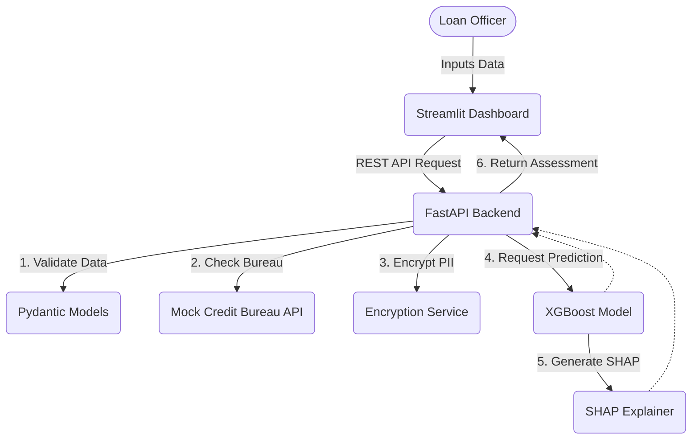

# Explainable AI Loan Default Prediction


An **end-to-end Machine Learning ecosystem** designed to predict loan default risks while prioritizing **Explainable AI (XAI)**, data security, and fairness. This project is built as a robust, enterprise-grade prototype to demonstrate how AI can be integrated into financial services responsibly and transparently.

---

## 📖 Overview

In the financial sector, a "black-box" model is often unacceptable due to regulatory requirements and the need for human oversight. This project bridges the gap between complex ML predictions and human interpretability. 

It provides an end-to-end solution featuring:
1. A **data processing pipeline** that handles class imbalance and feature engineering.
2. A **predictive model (XGBoost)** that estimates the probability of default.
3. An **Explainability layer (SHAP)** that explains exactly *why* a decision was made.
4. A secure **FastAPI backend** that serves the model and handles mock third-party integrations (e.g., Credit Bureaus).
5. An interactive **Streamlit Dashboard** for loan officers to evaluate applications in real-time.

---

## ✨ Key Features & Business Value

- **Explainable AI (SHAP):** Provides a transparent breakdown of feature contributions for every single prediction, empowering loan officers to make informed decisions rather than blindly trusting an algorithm.
- **Microservices Architecture:** Decouples the ML model serving (FastAPI) from the user interface (Streamlit) for better scalability and separation of concerns.
- **Enterprise-Grade Security:** Simulates PII data encryption (using `cryptography` Fernet) to demonstrate how sensitive applicant data should be handled in production.
- **Fairness & Bias Evaluation:** Incorporates fairness checks to ensure the model does not discriminate based on protected attributes, aligning with regulatory compliance standards.
- **Resilient Integrations:** Mocks enterprise external API calls (e.g., pulling Credit Scores) with robust retry logic and error handling.
- **Automated Testing:** Uses `pytest` to ensure pipeline and endpoint reliability.

---

## 🛠️ Technology Stack

| Category | Technologies |
| :--- | :--- |
| **Machine Learning** | Scikit-Learn, XGBoost, SHAP, Pandas, NumPy, imbalanced-learn |
| **Backend & API** | FastAPI, Pydantic, SQLAlchemy, Uvicorn, httpx |
| **Frontend UI** | Streamlit, Plotly |
| **Security & Auth** | bcrypt, Python Cryptography (Fernet) |
| **Testing** | Pytest |

---

## 🏗️ System Architecture



---

## 📁 Project Structure

```text
AI-loan-default-prediction/
├── api/                           # FastAPI server & REST endpoints
│   └── main.py
├── app/                           # Streamlit interactive dashboard
│   └── app.py
├── data/                          # Raw and processed datasets
│   ├── mlops.db
│   ├── processed/
│   │   ├── cleaned_data.csv
│   │   └── model_data.csv
│   └── row/
│       └── credit_risk_dataset.csv
├── database/                      # SQL schemas
│   └── schema.sql
├── models/                        # Serialized model artifacts (.pkl)
│   ├── best_model.pkl
│   ├── logistic_regression.pkl
│   ├── random_forest.pkl
│   └── xgboost.pkl
├── notebooks/                     # Jupyter notebooks (EDA to Explainability)
│   ├── 01_data_understanding.ipynb
│   ├── 02_data_cleaning.ipynb
│   ├── 03_exploratory_data_analysis.ipynb
│   ├── 04_feature_engineering.ipynb
│   ├── 05_model_training.ipynb
│   ├── 06_model_comparison.ipynb
│   └── 07_model_explainability.ipynb
├── src/                           # Core business logic and ML pipeline
│   ├── credit_bureau_api.py       # Mocked 3rd-party integrations
│   ├── database.py                # DB connection and setup
│   ├── encryption.py              # PII encryption utilities
│   ├── fairness.py                # Model bias and fairness auditing
│   ├── feature_engineering.py     # Feature creation & scaling
│   ├── prediction.py              # Prediction service layer
│   └── preprocessing.py           # Data cleaning & imputation
├── tests/                         # Pytest test suite
│   └── test_prediction.py
├── .env                           # Environment variables configuration
├── .gitignore                     # Git ignore rules
└── requirements.txt               # Project dependencies
```

---

## ⚙️ Setup & Installation

### Prerequisites
- **Python 3.9+**
- Git

### 1. Clone the Repository
```bash
git clone https://github.com/HimashMadushanka/Ai-loan-default-prediction.git
cd AI-loan-default-prediction
```

### 2. Create a Virtual Environment
```bash
python -m venv .venv
# On Windows:
.\.venv\Scripts\Activate.ps1
# On Linux/Mac:
source .venv/bin/activate
```

### 3. Install Dependencies
```bash
pip install -r requirements.txt
```

### 4. Configure Environment Variables
Create a `.env` file in the root directory with the following structure:
```env
API_KEY=your_secure_api_key_here
ENCRYPTION_KEY=your_fernet_encryption_key_here
```
*(Note: You can generate a Fernet key using the `cryptography` library in Python).*

---

## 🚀 Running the Ecosystem

### 1. Model Retraining (Optional)
If you wish to retrain the models from scratch using the raw data:
```bash
python src/preprocessing.py
python src/feature_engineering.py
```
*(You can then run `notebooks/05_model_training.ipynb` to generate the `.pkl` artifacts).*

### 2. Launch the FastAPI Backend
Start the robust REST API that serves the model:
```bash
uvicorn api.main:app --reload
```
- **Interactive Swagger Docs:** `http://localhost:8000/docs`
- **ReDoc:** `http://localhost:8000/redoc`

### 3. Launch the Streamlit Dashboard
In a new terminal window (with the virtual environment activated), start the user interface:
```bash
streamlit run app/app.py
```
The dashboard will open automatically in your browser, allowing you to input applicant data and view the real-time risk assessment and SHAP explanations.

---

## 🧪 Testing

To ensure the integrity of the predictive pipeline and endpoints, run the automated test suite:
```bash
pytest tests/ -v
```

---

## ⚠️ Important Considerations & Limitations

This project is built as a **portfolio and educational prototype** to demonstrate full-stack ML engineering capabilities. 

If this were to be deployed in a real-world financial institution, the following would be required:
- **Regulatory Compliance:** Strict mathematical proof to regulators (e.g., CFPB) that the model does not violate fair lending laws.
- **Production Infrastructure:** Deployment via Docker/Kubernetes, CI/CD pipelines (GitHub Actions), and robust model monitoring (MLOps) for data drift.
- **Real Integrations:** Replacing mock endpoints with secure, highly available connections to actual credit bureaus (Equifax, Experian).

---

## 👨‍💻 Author
**Himash Madushanka**  
Feel free to reach out or open an issue if you have questions or suggestions!
